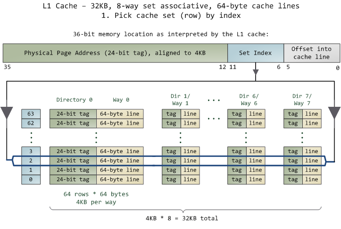
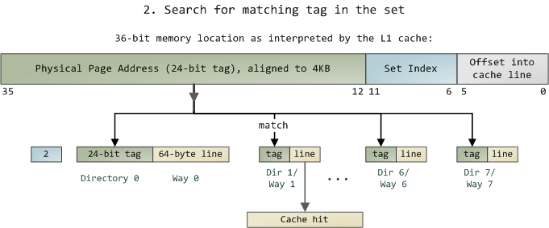

# Cache: a place for concealment and safekeeping, 2009

https://web.archive.org/web/20241210232539/https://manybutfinite.com/post/intel-cpu-caches/

How CPU caches are organized in modern Intel processors. Cache discussions often lack concrete examples, obfuscating the simple concepts involved. Here is half the story on how a Core 2 L1 cache is accessed:

The unit of data in the cache is the *line*, which is just a contiguous chunk of bytes in memory. This cache uses *64-byte lines*. The lines are stored in *cache banks or ways*, and each way has a dedicated directory to store its admin information.

You can imagine each way and its directory as columns in a spreadsheet, in which case the rows are the sets. Then each cell in the way column contains a cache line, tracked by the corresponding cell in the directory. This particular cache has 64 sets and 8 ways, hence 512 cells to store cache lines, which adds up to 32KB of space.

In this cache's view of the world, physical memory is divided into *4KB physical pages*. Each page has 64 cache lines in it (4KB / 64 bytes).

When you look at a 4KB page, bytes 0 through 63 within that page are in the first cache line, bytes 64-127 in the second cache line, and so on. The pattern repeats for each page, so the 3rd line in page 0 is different than the 3rd line in page 1.

In a fully associative cache any line in memory can be stored in any of the cache cells. This makes storage flexible, but it becomes expensive to search for cells when accessing them. Since the L1 and L2 caches operate under tight constraints of power consumption, physical space, and speed, a fully associative cache is not a good trade off in most scenarios.

Instead, this cache is *set associative*, which means that a given line in memory can only be stored in one specific set (or row) shown above. 

So the first line of any physical page (bytes 0-63 within a page) must be stored in row 0, the second line in row 1, etc. 

Each row has 8 cells available to store the cache lines it is associated with, making this an 8-way associative set. 

When looking at a memory address, bits 11-6 determine the line number within the 4KB page and therefore the set to be used. For example, physical address 0x800010a0 has 000010 in those bits so it must be stored in set 2.

But we still have the problem of finding which cell in the row holds the data, if any. That's where the directory comes in. Each cached line is tagged by its corresponding directory cell; the tag is simply the number for the page where the line came from. The processor can address 64GB of physical RAM, so there are 64GB / 4KB == 224 of these pages and thus we need 24 bits for our tag. Our example physical address 0x800010a0 corresponds to page number 524,289. Here's the second half of the story:

Since we only need to look in one set of 8 ways, the tag matching is very fast; in fact, electrically all tags are compared simultaneously, which I tried to show with the arrows. If there's a valid cache line with a matching tag, we have a cache hit. Otherwise, the request is forwarded to the L2 cache, and failing that to main system memory. Intel builds large L2 caches by playing with the size and quantity of the ways, but the design is the same. For example, you could turn this into a 64KB cache by adding 8 more ways. Then increase the number of sets to 4096 and each way can store 256KB. These two modifications would deliver a 4MB L2 cache. In this scenario, you'd need 18 bits for the tags and 12 for the set index; the physical page size used by the cache is equal to its way size.

If a set fills up, then a cache line must be evicted before another one can be stored. To avoid this, performance-sensitive programs try to organize their data so that memory accesses are evenly spread among cache lines. For example, suppose a program has an array of 512-byte objects such that some objects are 4KB apart in memory. Fields in these objects fall into the same lines and compete for the same cache set. If the program frequently accesses a given field (e.g., the vtable by calling a virtual method), the set will likely fill up and the cache will start trashing as lines are repeatedly evicted and later reloaded. Our example L1 cache can only hold the vtables for 8 of these objects due to set size. This is the cost of the set associativity trade-off: we can get cache misses due to set conflicts even when overall cache usage is not heavy. However, due to the relative speeds in a computer, most apps don't need to worry about this anyway.

A memory access usually starts with a linear (virtual) address, so the L1 cache relies on the paging unit to obtain the physical page address used for the cache tags. By contrast, the set index comes from the least significant bits of the linear address and is used without translation (bits 11-6 in our example). Hence the L1 cache is physically tagged but virtually indexed, helping the CPU to parallelize lookup operations. Because the L1 way is never bigger than an MMU page, a given physical memory location is guaranteed to be associated with the same set even with virtual indexing. L2 caches, on the other hand, must be physically tagged and physically indexed because their way size can be bigger than MMU pages. But then again, by the time a request gets to the L2 cache the physical address was already resolved by the L1 cache, so it works out nicely.

Finally, a directory cell also stores the state of its corresponding cached line. A line in the L1 code cache is either Invalid or Shared (which means valid, really). In the L1 data cache and the L2 cache, a line can be in any of the 4 MESI states: Modified, Exclusive, Shared, or Invalid. Intel caches are inclusive: the contents of the L1 cache are duplicated in the L2 cache. These states will play a part in later posts about threading, locking, and that kind of stuff. Next time we'll look at the front side bus and how memory access really works. This is going to be memory week.

Update: Dave brought up direct-mapped caches in a comment below. They're basically a special case of set-associative caches that have only one way. In the trade-off spectrum, they're the opposite of fully associative caches: blazing fast access, lots of conflict misses.
