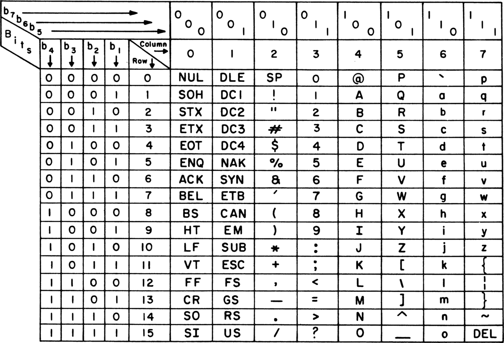

# ASCII

ASCII (American Standard Code for Information Interchange) is a *character encoding standard* for electronic communication. ASCII codes represent text in computers, telecommunications equipment, and other devices. The prevailing modern character-encoding scheme, Unicode, is based on the ASCII.

Because of technical limitations of computer systems at the time it was invented, ASCII uses just 7 bits, of the later standardized byte, which is comprised of 8 bits. Considering the now standard 8-bit byte, the unused bit is the leftmost bit, called the most significant bit (msb).


, with which one can encode 2⁷ = 128 different values.


128 code points, i.e. it uses 7 bits which can encode 2⁷ = 128 different values. The 8th (or the 7th in 0-indexing), aka *the most significant bit*, is not used for encoding, although it may be used by applications or protocols for other purposes (e.g. as parity bit).

Of the 128 possible values, 95 are used to encode *printable characters*, while the remaining 33 are *device control characters*. Namely, ASCII was designed in the 1960s for teleprinters and telegraphy, and these machines could only process one character at a time, returning to an idle state immediately afterward. In order to manipulate these devices any control sequences had to be one character long, which is what the 33 ASCII codes are intended for (2 columns of 16 devioce control characters, plus the DEL char, 0x7F).


A table to represent the 128 ASCII characters can be arranged in different ways regarding the number of rows and columns (2×64, 4×32, 8×16), but the last one is optimal: 8 columns with 16 characters in each. When the hexadecimal notation is used for numbers, the arrangements of different groups of characters become more clear. A single hex digit can represent the 16 characters in each column, meaning the units hex digit will be in the range 0x0 - 0xf, depending on the row (0 - 15 rows). Rows and columns use 0-based indexing, so the zeroth column contains the 16 characters labelled 0x0 - 0xf (from 0 to 15). The 16 entries in the column K are labelled 0×`K`0 - 0×Kf, where K ranges 0 - 7 (eight columns, labelled from 0 to 7).

7 bits:   b₆ b₅ b₄   b₃ b₂ b₁ b₀

from 000 0000 (0x00)
to   111 1111 (0x7F)




```
ᵇⁱᵗ  ₆₅₄      ₆₅₄      ₆₅₄      ₆₅₄      ₆₅₄      ₆₅₄      ₆₅₄      ₆₅₄

b₆   0        0        0        0        1        1        1        1
 b₅   0        0        1        1        0        0        1        1
  b₄   0        1        0        1        0        1        0        1

     000      001      010      011      100      101      110      111
      0        1        2        3        4        5        6        7        |
0                                                                             |
1                                                                             |
2                                                                             |
3                                                                             |
4                                                                             |
5                                                                             |
6                                                                             |
7                                                                             |
8                                                                             |
9                                                                             |
a                                                                             |
b                                                                             |
c                                                                             |
d                                                                             |
e                                                                             |
f                                                                             |
```


- 0x0 - 0x7f (hex)
- 0 - 127 (decimal)

Seven-bit ASCII

Of the 128 (2⁷) codes, 33 were used for device control, and 95 carefully selected printable characters (94 glyphs and one space), which include the English alphabet (uppercase and lowercase), digits, and 31 punctuation marks and symbols: all of the symbols on a standard US typewriter plus a few selected for programming tasks.

Some popular peripherals only implemented a 64-printing-character subset: Teletype Model 33 could not transmit "a" through "z" or five less-common symbols ("`", "{", "|", "}", and "~"). and when they received such characters they instead printed "A" through "Z" (forced all caps) and five other mostly-similar symbols ("@", "[", "\", "]", and "^").


Modern computer systems have evolved to use Unicode, which has millions of code points, but the first 128 of these are the same as the ASCII set.

The Internet Assigned Numbers Authority (IANA) prefers the name US-ASCII for this character encoding.

ASCII is one of the IEEE milestones.


ASCII was designed in the 1960s for teleprinters and telegraphy, and some computing. Early teleprinters were electromechanical, having no microprocessor and just enough electromechanical memory to function. They fully processed one character at a time, returning to an idle state immediately afterward; this meant that any control sequences had to be only one character long, and thus a large number of codes needed to be reserved for such controls. They were typewriter-derived impact printers, and could only print a fixed set of glyphs, which were cast into a metal type element or elements; this also encouraged a minimum set of glyphs.


## Refs
https://en.wikipedia.org/wiki/ASCII
https://en.wikipedia.org/wiki/Extended_ASCII
https://en.wikipedia.org/wiki/Character_encoding
https://en.wikipedia.org/wiki/Control_Pictures
https://theasciicode.com.ar/
https://www.iana.org/assignments/character-sets/character-sets.xhtml
https://iconoun.com/articles/collisions/

* Timeline of electrical and electronic engineering
https://en.wikipedia.org/wiki/Timeline_of_electrical_and_electronic_engineering
