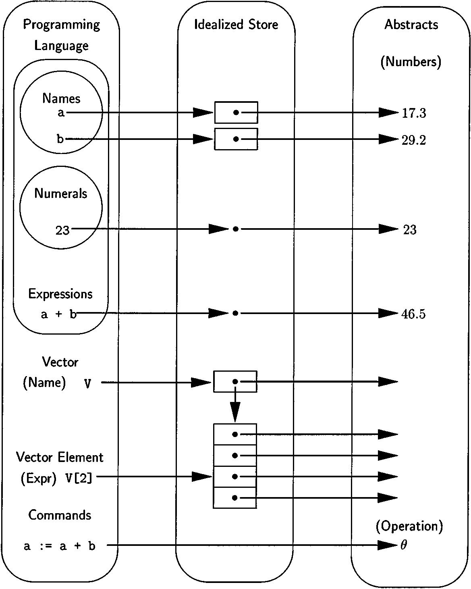

# Fundamental Concepts of Programming Languages
Christopher Strachey, 1970

## Abstract

This paper forms the substance of a course of lectures given at the International Summer School in Computer Programming at Copenhagen in August, 1967. The lectures were originally given from notes and the paper was written after the course was finished. In spite of this, and only partly because of the shortage of time, the paper still retains many of the shortcomings of a lecture course. The chief of these are an uncertainty of aim - it is never quite clear what sort of audience there will be for such lectures - and an associated switching from formal to informal modes of presentation which may well be less acceptable in print than it is natural in the lecture room.

There are numerous references throughout the course to `CPL`. This is a programming language which has been under development since 1962 at Cambridge and London and Oxford. It has served as a vehicle for research into both programming languages and the design of compilers. Partial implementations exist at Cambridge and London. The language is still evolving so that there is no definitive manual available yet. We hope to reach another resting point in its evolution quite soon and to produce a compiler and reference manuals for this version. The compiler will probably be written in such a way that it is relatively easy to transfer it to another machine, and in the first instance we hope to establish it on three or four machines more or less at the same time. The lack of a precise formulation for CPL should not cause much difficulty in this course, as we are primarily concerned with the ideas and concepts involved rather than with their precise representation in a programming language.

Keywords:
- programming languages
- semantics
- foundations of computing
- CPL
- L-values
- R-values
- parameter passing
- variable binding
- functions as data
- parametric polymorphism
- ad hoc polymorphism
- binding mechanisms
- type completeness

## 1. Preliminaries

### 1.1. Introduction

Any discussion on the foundations of computing runs into severe problems right at the start. The difficulty is that although we all use words such as *name*, *value*, *program*, *expression* or *command* which we think we understand, it often turns out on closer investigation that in point of fact we all mean different things by these words, so that communication is at best precarious.

These misunderstandings arise in at least two ways. The first is straightforwardly incorrect or muddled thinking. An investigation of the meanings of these basic terms is undoubtedly an exercise in mathematical logic and neither to the taste nor within the field of competence of many people who work on programming languages.

As a result the practice and development of programming languages has outrun our ability to fit them into a secure mathematical framework so that they have to be described in ad hoc ways. Because these start from various points they often use conflicting and sometimes also inconsistent interpretations of the same basic terms.

A second and more subtle reason for misunderstandings is the existence of profound differences in philosophical outlook between mathematicians. This is not the place to discuss this issue at length, nor am I the right person to do it. I have found, however, that these differences affect both the motivation and the methodology of any investigation like this to such an extent as to make it virtually incomprehensible without some preliminary warning. In the rest of the section, therefore, I shall try to outline my position and describe the way in which I think the mathematical problems of programming languages should be tackled.

### Philosophical considerations

I think we should try to give a new concept a neutral name. The number of new concepts required may ultimately be quite large, but most of these will be constructs which can be defined with considerable precision in terms of a much smaller number of more basic ones. This intermediate form of definition should always be made as precise as possible although the rigorous description of the basic concepts in terms of more elementary ideas may not yet be available.

My aim is not to give an historical account of how we reached the present position but to try to convey what the position is. For this reason I have often preferred a somewhat informal approach even when mere formality would in fact have been easy.

## 2. Basic concepts

### 2.1. Assignment commands

One of the characteristic features of computers is that they have a store into which it is possible to put information and from which it can subsequently be recovered. Furthermore the act of inserting an item into the store erases whatever was in that particular area of the store before - in other words the process is one of overwriting. This leads to the *assignment command* which is a prominent feature of most programming languages.

The meaning of an expression (and a name or identifier is only a simple case of an expression) on the left of an assignment is clearly different from its meaning on the right. Roughly speaking, an expression on the left stands for an *address*, and one on the right for a *value* which will be stored there.

We shall therefore accept this view and say that there are two values associated with an expression or identifier. In order to avoid the overtones which go with the word 'address' we shall give these two values the neutral names: **L-value** for the *address-like object* appropriate on the left of an assignment, and **R-value** for the *contents-like object* appropriate for the right.

### 2.2. L-values and R-values

An *L-value* represents an area of the store of the computer. We call this a *location* rather than an address, in order to avoid confusion with the normal store-addressing mechanism of the computer. There is no reason why a location should be exactly one machine-word in size. Some locations are *addressable* (in which case their numerical machine address may be a good representation) but some are not. Before we can decide what sort of representation a general, *non-addressable location* should have, we should consider what properties we require of it.

The two essential features of a location are that it has a content, i.e. an associated R-value, and that it is in general possible to change this content by a suitable updating operation. These two operations are sufficient to characterise a *general location* which are consequently sometimes known as *Load-Update Pairs* (LUPs).

### 2.3. Definitions

In CPL a programmer can introduce a new quantity and give it a value by an initialised definition such as `let p = 3.5` (In ALGOL this would be done by `real p; p := 3.5;`). This introduces a new use of the name (identifier) `p`, and the best way of looking at this is that the *activation of the definition* causes a new location to be set up as the L-value of `p`, and that the R-value 3.5 is then assigned to this location.

The relationship between a name and its L-value cannot be altered by assignment, and it is this fact which makes the L-value important. However, one name can have several different L-values in different parts of the program. It is the concept of *scope* (also called lexicographical or *lexical scope*), controlled by the *block structure*, that allows us to determine at any point which L-value is relevant.

In CPL (but not in ALGOL), it is also possible to have several names with the same L-value. This is done by using a special form of definition, `let q ≃ p`, which has the effect of giving the name of the same L-value as `p` (which must already exist). This feature is generally used when the right side of the definition is a more complicated expression than a simple name.

Thus, if `M` is a matrix, the definition `let x ≃ M[2,2]` gives `x` the same L-value as one of the elements of the matrix.

It is then said to be *sharing* or *aliasing* with M[2,2], and an *assignment to `x` will have the same effect as an assignment to* M[2,2].

It is worth noting that the expression on the right of this form of definition is *evaluated in the L-mode* to get an L-value at the time the definition is obeyed. It is this L-value which is associated with `x`.

Thus, if we have `let i = 2; let x ≃ M[i,i]; i := 3`, the L-value of `x` will remain that of M[2,2].

M[i,i] is an example of an *anonymous quantity* - that is, an expression rather than a simple name - which has both an L-value and an R-value.

There are other expressions, such as `a + b`, which only have R-values. In both cases, the expression has no name per se, although it does have either one value or two.

### 2.4. Names

It is important to be clear about this as a good deal of confusion can be caused by differing uses of the terms. ALGOL 60 uses 'identifier' where we have used 'name', and reserves the word 'name' for a wholly different use concerned with the mode of calling parameters for a procedure. 

ALGOL X, on the other hand, appears likely to use the word 'name' to mean approximately what we should call an L-value, (and hence something which is a *location* or *generalised address*). The term 'reference' is also used by several languages to mean (again approximately) an L-value.

It seems to me wiser not to make a distinction between the meaning of 'name' and that of 'identifier' and I shall use them interchangeably.

The important feature of a name is that it has *no internal structure* (in the context in which we are using it as a name).

*Names are thus atomic objects* and the only thing we know about them is that given two names, it is always possible to determine whether they are the same name or not.

### 2.5. Numerals

We use the word *number* for the abstract object and *numeral* for its written representation.

In general, numerals do have an internal structure and are therefore not atomic in the sense that names are.

An interpretation more in keeping with our general approach is to regard numerals as R-value expressions written according to special rules; e.g. numeral 253 is a syntactic variant for the expression `2 * 10² + 5 * 10 + 3`.

Local rules for special forms of expression can be regarded as a sort of *micro-syntax* and form an important feature of programming languages. The micro-syntax is frequently used in a preliminary 'pre-processing' or 'lexical' pass of compilers to deal with the recognition of names, numerals, strings, basic symbols, and similar objects which are represented in the input stream by strings of symbols in spite of being *atomic internally* in the language.

With this interpretation the only numerals which are also names are the single digits and these are, of course, constants with the appropriate R-value.

### 2.6. Conceptual model

A conceptual model shows the relationships between
- the various objects in the programming language
- their representations in the memory
- the abstract objects to which they correspond

On the left are some of the components of the programming language. Many of these correspond to either an L-value or an R-value and the correspondence is indicated by an arrow terminating on the value concerned. Both L-values and R-values are in the idealised store, a location being represented by a box and its contents by a dot inside it. R-values without corresponding L-values are represented by dots without boxes, and R-values which are themselves locations (as, for example, that of a vector) are given arrows which terminate on another box in the idealised store. R-values which correspond to numbers are given arrows which terminate in the right hand part of the diagram which represents the abstract objects with which the program deals.

## 3. Conceptual constructs

### 3.1. Expressions and commands
