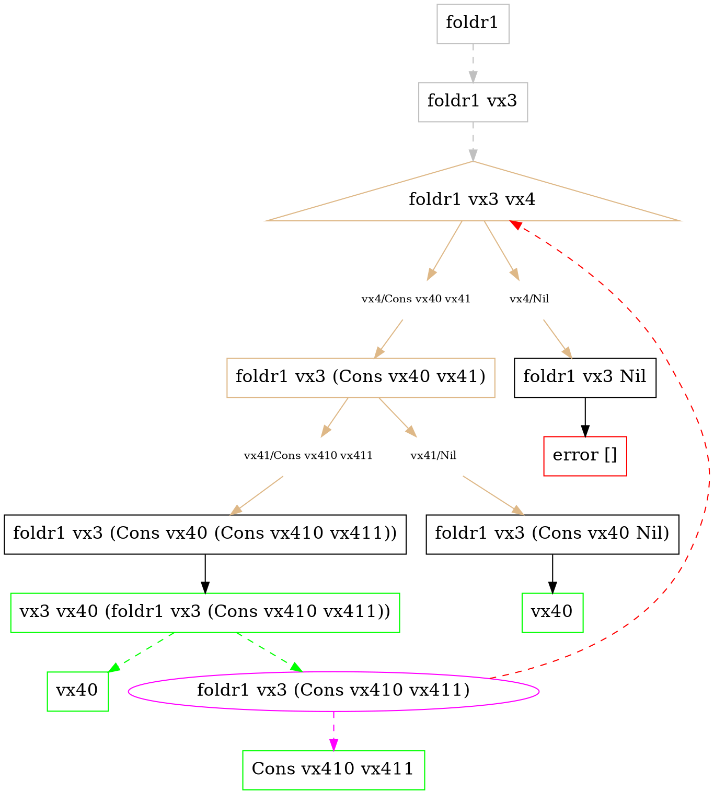

# Termination

```graphviz
digraph dp_graph {
node [outthreshold=100, inthreshold=100];1[label="foldr1",fontsize=16,color="grey",shape="box"];1 -> 3[label="",style="dashed", color="grey", weight=3];
3[label="foldr1 vx3",fontsize=16,color="grey",shape="box"];3 -> 4[label="",style="dashed", color="grey", weight=3];
4[label="foldr1 vx3 vx4",fontsize=16,color="burlywood",shape="triangle"];15[label="vx4/Cons vx40 vx41",fontsize=10,color="white",style="solid",shape="box"];4 -> 15[label="",style="solid", color="burlywood", weight=9];
15 -> 5[label="",style="solid", color="burlywood", weight=3];
16[label="vx4/Nil",fontsize=10,color="white",style="solid",shape="box"];4 -> 16[label="",style="solid", color="burlywood", weight=9];
16 -> 6[label="",style="solid", color="burlywood", weight=3];
5[label="foldr1 vx3 (Cons vx40 vx41)",fontsize=16,color="burlywood",shape="box"];17[label="vx41/Cons vx410 vx411",fontsize=10,color="white",style="solid",shape="box"];5 -> 17[label="",style="solid", color="burlywood", weight=9];
17 -> 7[label="",style="solid", color="burlywood", weight=3];
18[label="vx41/Nil",fontsize=10,color="white",style="solid",shape="box"];5 -> 18[label="",style="solid", color="burlywood", weight=9];
18 -> 8[label="",style="solid", color="burlywood", weight=3];
6[label="foldr1 vx3 Nil",fontsize=16,color="black",shape="box"];6 -> 9[label="",style="solid", color="black", weight=3];
7[label="foldr1 vx3 (Cons vx40 (Cons vx410 vx411))",fontsize=16,color="black",shape="box"];7 -> 10[label="",style="solid", color="black", weight=3];
8[label="foldr1 vx3 (Cons vx40 Nil)",fontsize=16,color="black",shape="box"];8 -> 11[label="",style="solid", color="black", weight=3];
9[label="error []",fontsize=16,color="red",shape="box"];10[label="vx3 vx40 (foldr1 vx3 (Cons vx410 vx411))",fontsize=16,color="green",shape="box"];10 -> 12[label="",style="dashed", color="green", weight=3];
10 -> 13[label="",style="dashed", color="green", weight=3];
11[label="vx40",fontsize=16,color="green",shape="box"];12[label="vx40",fontsize=16,color="green",shape="box"];13 -> 4[label="",style="dashed", color="red", weight=0];
13[label="foldr1 vx3 (Cons vx410 vx411)",fontsize=16,color="magenta"];13 -> 14[label="",style="dashed", color="magenta", weight=3];
14[label="Cons vx410 vx411",fontsize=16,color="green",shape="box"];}
```
