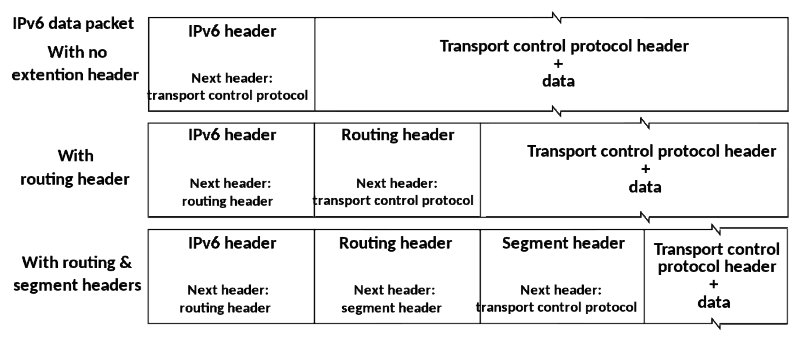
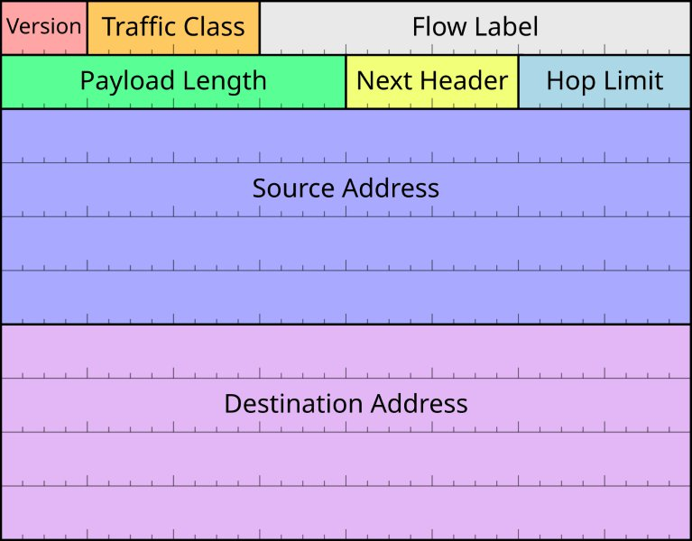

# IPv6 protocol

https://en.wikipedia.org/wiki/IPv6

**Internet Protocol version 6 (IPv6)** is the most recent version of the Internet Protocol (IP), the communications protocol that provides an identification and location system for computers on networks and routes traffic across the Internet.

IPv6 was developed by the IETF to deal with the long-anticipated problem of IPv4 address exhaustion, and was intended to replace IPv4.

In December 1998, IPv6 became a Draft Standard for the IETF, which subsequently ratified it as an Internet Standard on 14 July 2017.

Devices on the Internet are assigned a unique IP address for identification and location definition.

With the rapid growth of the Internet after commercialization in the 1990s, it became evident that far more addresses would be needed to connect devices than the IPv4 address space had available. By 1998, the IETF had formalized the successor protocol. 

IPv6 uses 128-bit addresses, theoretically allowing `2¹²⁸`. The actual number is slightly smaller, as multiple ranges are reserved for special usage or completely excluded from general use.

The two protocols are not designed to be interoperable, and thus direct communication between them is impossible, complicating the move to IPv6. However, several transition mechanisms have been devised to rectify this.

IPv6 provides other technical benefits in addition to a larger addressing space. In particular, it permits *hierarchical address allocation methods* that facilitate *route aggregation* across the Internet, and thus limit the expansion of *routing tables*.

The use of *multicast addressing* is expanded and simplified, and provides additional optimization for the delivery of services.

Device mobility, security, and configuration aspects have been considered in the design of the protocol.

IPv6 addresses are represented as 8 groups of 4 hexadecimal digits each, separated by colons. These groups are called **hextets** or **quartets**.

The full representation may be shortened, e.g. `2001:db8::8a2e:370:7334` gets expanded into `2001:0db8:0000:0000:0000:8a2e:0370:7334`.

## Contents

- 1. Main features
- 2. Motivation and origin
  - 2.1 IPv4 address exhaustion
- 3. Comparison with IPv4
  - 3.1 Larger address space
  - 3.2 Multicasting
  - 3.3 Stateless address autoconfiguration (SLAAC)
  - 3.4 IPsec
  - 3.5 Simplified processing by routers
  - 3.6 Mobility
  - 3.7 Extension headers
- 4. IPv6 packets
- 5. Addressing
  - 5.1 Address representation
  - 5.2 Link-local address
  - 5.3 Address uniqueness and router solicitation
  - 5.4 Global addressing
- 6. IPv6 in the Domain Name System
- 7. Transition mechanisms
  - 7.1 Dual-stack IP implementation
  - 7.2 ISP customers with public-facing IPv6
  - 7.3 Tunneling
  - 7.4 IPv4-mapped IPv6 addresses
- 8. Security
  - 8.1 Shadow networks
  - 8.2 IPv6 packet fragmentation
- 9. Standardization through RFCs
  - 9.1 Working-group proposals
  - 9.2 RFC standardization
- 10. Deployment
- 11. See also
- 12. References
- 13. External links


## Main features

IPv6 is an *Internet Layer protocol* for packet-switched internetworking and provides end-to-end datagram transmission across multiple IP networks, closely adhering to the design principles developed in the previous version of the protocol, Internet Protocol Version 4 (IPv4).

In addition to offering more addresses, IPv6 also implements features not present in IPv4.

IPv6 simplifies aspects of *address configuration*, *network renumbering*, and *router announcements* when changing network connectivity providers.

It simplifies *packet processing in routers* by placing the responsibility for *packet fragmentation* in the end points. 

The IPv6 *subnet size* is standardized by fixing the size of the *host identifier* portion of an address to 64 bits.

The addressing architecture of IPv6 is defined in RFC 4291:
https://datatracker.ietf.org/doc/html/rfc4291

IPv6 allows 3 types of transmission: unicast, anycast and multicast; with the broadcast performed through multicast.

## Comparison with IPv4

- compatibility with existing protocols
- larger address space: bigger addr space, but also bigger transmission units
- multicasting
- SLAAC
- IPsec
- Simplified processing by routers
- Mobility
- Extension headers
- Jumbograms


On the Internet, data is transmitted in the form of network packets. IPv6 specifies a new packet format, designed to minimize overhead and packet header processing by routers.

Because the headers of IPv4 packets and IPv6 packets are significantly different, the two protocols are not interoperable.

However, most transport and application-layer protocols need little or no change to operate over IPv6; exceptions are application protocols that embed Internet-layer addresses, such as FTP and NTP, where the new address format may cause conflicts with existing protocol syntax.

### Larger address space

The main advantage of IPv6 over IPv4 is its larger address space: the size of an IPv6 address is 128 bits, compared to 32 bits in IPv4.

It has 340,282,366,920,938,463,463,374,607,431,768,211,456 addresses, although some blocks and some specific addresses are reserved for special uses.

While this address space is very large, it was not the intent of the designers of IPv6 to assure geographical saturation with usable addresses. Rather, the longer addresses 
- simplify allocation of addresses
- enable hierarchical route aggregation
- allow implementation of special addressing features

In IPv4, complex CIDR methods were developed to make the best use of the small address space. The standard size of a subnet in IPv6 is 2⁶⁴ addresses, about 4 billion times the size of the entire IPv4 address space.

Thus, actual address space utilization will be small in IPv6, but network management and routing efficiency are improved by the large subnet space and hierarchical route aggregation.

### Multicasting

IPv6 multicast address structure:
```
8 bits    | 4 bits | 4 bits | 112 bits
1111 1111 | Flags  | Scope  | Group ID
```

Flags (ORPT):
- `O` ???
- `R` Randez-vous point flag
- `P` Prefix flag
- `T` Transient flag


**Multicasting**, the transmission of a packet to multiple destinations in a single send operation, is part of the base specification in IPv6. In IPv4 this is an optional (although commonly implemented) feature.

IPv6 multicast addressing has features and protocols in common with IPv4 multicast, but also provides changes and improvements by eliminating the need for certain protocols.

IPv6 does not implement traditional IP broadcast, i.e. the transmission of a packet to all hosts on the attached link using a special broadcast address, and therefore does not define broadcast addresses.

IPv6 accomplishes the same by sending a packet to the *link-local all nodes multicast group* at address `ff02::1`, which is analogous to IPv4 multicasting to address `224.0.0.1`.

IPv6 also provides for new multicast implementations, including embedding rendez-vous point addresses in an IPv6 multicast group address, which simplifies the deployment of inter-domain solutions.

In IPv4 it is very difficult for an organization to get even one globally routable multicast group assignment, and the implementation of inter-domain solutions is arcane.

Unicast address assignments by a local Internet registry for IPv6 have *at least a 64-bit routing prefix*, yielding the smallest subnet size available in IPv6 (also 64 bits).

>With such an assignment it is possible to embed the unicast address prefix into the IPv6 multicast address format, while still providing a 32-bit block, the least significant bits of the address, or approximately 4.2 billion multicast group identifiers.

Thus, each user of an IPv6 subnet automatically has available a set of globally routable source-specific multicast groups for multicast applications.

### SLAAC

See also: IPv6 address § Stateless address autoconfiguration
https://en.wikipedia.org/wiki/IPv6_address#Stateless_address_autoconfiguration_(SLAAC)

>IPv6 hosts can configure themselves automatically. Every interface has a self-generated link-local address and, when connected to a network, conflict resolution is performed and routers provide network prefixes via router advertisements.

*Stateless configuration of routers* can be achieved with a special *router renumbering protocol*.

When necessary, hosts may configure additional *stateful addresses* via DHCPv6 or static addresses manually.

Like IPv4, IPv6 supports globally unique IP addresses. The design of IPv6 intended to re-emphasize the end-to-end principle of network design that was originally conceived during the establishment of the early Internet by rendering network address translation obsolete. 
>Therefore, every device on the network is globally addressable directly from any other device.

A stable, unique, globally addressable IP address would facilitate tracking a device across networks. Therefore, such addresses are a particular privacy concern for mobile devices, such as laptops and cell phones.

To address these privacy concerns, the SLAAC protocol includes what are typically called privacy addresses, or, more correctly, temporary addresses, codified in RFC 4941, [Privacy Extensions for Stateless Address Autoconfiguration in IPv6](https://datatracker.ietf.org/doc/html/rfc4941).

>**Temporary addresses** are random and unstable. A typical consumer device generates a new temporary address daily, and will ignore traffic addressed to an old address after one week.

Renumbering an existing network for a new connectivity provider with different routing prefixes is a major effort with IPv4. With IPv6, however, changing the prefix announced by a few routers can in principle renumber an entire network, since the *host identifiers (the least-significant 64 bits of an address)* can be independently self-configured by a host.

The SLAAC address generation method is implementation-dependent. IETF recommends that addresses be deterministic but semantically opaque.

### IPsec

Internet Protocol Security (IPsec) was originally developed for IPv6, but found widespread deployment first in IPv4, for which it was re-engineered. 

IPsec was a mandatory part of all IPv6 protocol implementations, and *Internet Key Exchange* (IKE) was recommended, but with RFC 6434 the inclusion of IPsec in IPv6 implementations was downgraded to a recommendation because it was considered impractical to require full IPsec implementation for all types of devices that may use IPv6.

However, as of RFC 4301, IPv6 protocol implementations that do implement IPsec need to implement `IKEv2` and need to support a minimum set of cryptographic algorithms. This requirement will help to make IPsec implementations more interoperable between devices from different vendors.

The IPsec *Authentication Header* (AH) and the *Encapsulating Security Payload* header (ESP) are implemented as IPv6 extension headers.

### Simplified processing by routers

The packet header in IPv6 is simpler than the IPv4 header. Many rarely used fields have been moved to optional header extensions. The IPv6 packet header has simplified the process of packet forwarding by routers.

Although IPv6 packet headers are at least twice the size of IPv4 packet headers, processing of packets that only contain the base IPv6 header by routers may, in some cases, be more efficient, because less processing is required in routers due to the headers being aligned to match common word sizes.

However, many devices implement IPv6 support in software (as opposed to hardware), thus resulting in very bad packet processing performance.

Additionally, for many implementations, the use of *Extension Headers* causes packets to be processed by a router's CPU, leading to poor performance or even security issues.

>An IPv6 header does not include a checksum.

The IPv4 header checksum is calculated for the IPv4 header, and has to be recalculated by routers every time the time to live (called hop limit in the IPv6 protocol) is reduced by one.

Integrity protection for the data that is encapsulated in the IPv6 packet is assumed to be assured by both the link layer or error detection in higher-layer protocols, namely TCP and UDP on the transport layer. Thus, while IPv4 allowed UDP datagram headers to have no checksum (indicated by 0 in the header field), IPv6 requires a checksum in UDP headers.

>IPv6 routers do not perform IP fragmentation.
IPv6 hosts are required to do one of the following:
- perform Path MTU Discovery
- perform end-to-end fragmentation
- send packets no larger than the default MTU (1280 octets)

### Mobility

Unlike mobile IPv4, mobile IPv6 avoids *triangular routing* and is therefore as efficient as native IPv6.

IPv6 routers may also allow entire subnets to move to a new router connection point without renumbering.

### Extension headers

>The IPv6 packet header has a minimum size of 40 octets (320 bits).

*Options* are implemented as extensions. This provides the opportunity to extend the protocol in the future without affecting the core packet structure.

However, RFC 7872 notes that some network operators drop IPv6 packets with extension headers when they traverse transit autonomous systems.



### Jumbograms

IPv4 limits packets to 65,535 (2¹⁶−1) octets of payload.

An IPv6 node can optionally handle packets over this limit, referred to as **jumbograms**, which can be as large as 4,294,967,295 (2³²−1) octets.

The use of jumbograms may improve performance over high-MTU links. The use of jumbograms is indicated by the *Jumbo Payload Option extension header*.

## IPv6 packets

Main article: IPv6 packet
https://en.wikipedia.org/wiki/IPv6_packet

IPv6 packet has two parts: a header and payload.



### Header

The **header** consists of a fixed portion with minimal functionality required for all packets and may be followed by optional extensions to implement special features.

>The fixed header occupies the first 40 octets (320 bits) of the IPv6 packet.

It contains the source and destination addresses, traffic class, hop count, and the type of the optional extension or payload which follows the header.

This *Next Header field* tells the receiver how to interpret the data which follows the header. If the packet contains options, this field contains the option type of the next option. The "Next Header" field of the last option points to the upper-layer protocol that is carried in the packet's payload.

The current use of the IPv6 *Traffic Class field* divides this between
- 6-bit Differentiated Services Code Point (DSCP) field
- 2-bit Explicit Congestion Notification (ECN) field

*Extension headers* carry options that are used for special treatment of a packet in the network, e.g. for routing, fragmentation, and for security using the IPsec framework.

### Payload

>Without special options, a **payload** must be less than 64kB.

With a *Jumbo Payload option*, specified in a *Hop-By-Hop Options extension header*, the payload must be less than 4 GB.

>Unlike with IPv4, routers never fragment a packet.
Hosts are expected to use Path MTU Discovery to make their packets small enough to reach the destination without needing to be fragmented.

IPv6 packet fragmentation
https://en.wikipedia.org/wiki/IPv6_packet#Fragmentation

## Addressing

Main article: IPv6 address
https://en.wikipedia.org/wiki/IPv6_address

General structure of IPv6 unicast address:
- 64 bits for routing prefix, /64
- 64 bits for interface identifier (hosts portion)

IPv6 addresses have 128 bits. The design of IPv6 address space implements a different design philosophy than in IPv4, in which subnetting was used to improve the efficiency of utilization of the small address space.

In IPv6, the address space is deemed large enough for the foreseeable future, and a local area subnet always uses 64 bits for the host portion of the address, designated as the *interface identifier*, while the most-significant 64 bits are used as the *routing prefix*.

While the myth has existed regarding IPv6 subnets being impossible to scan, RFC 7707 notes that patterns resulting from some IPv6 address configuration techniques and algorithms allow address scanning in many real-world scenarios.

### Address representation


### Link-local address


### Address uniqueness and router solicitation


### Global addressing
