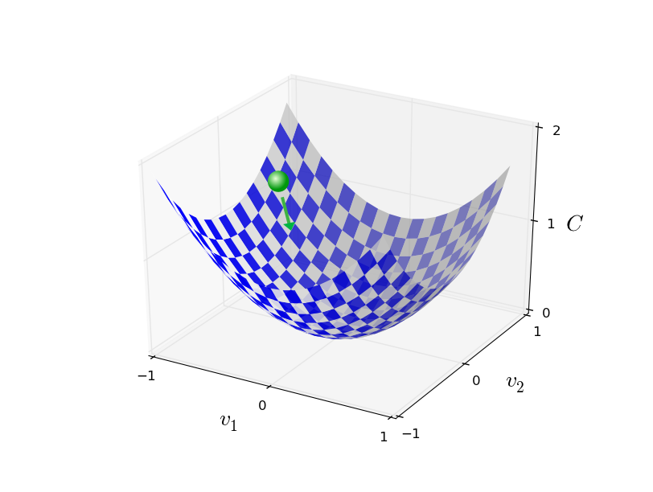

# Gradient descent

http://neuralnetworksanddeeplearning.com/chap1.html

Gradient Descent, Step-by-Step
https://www.youtube.com/watch?v=sDv4f4s2SB8&list=PLblh5JKOoLUIxGDQs4LFFD--41Vzf-ME1&index=4

https://en.wikipedia.org/wiki/Gradient_descent


>The goal in training a neural network is to find weights and biases which minimize the quadratic cost function `C(w,b)`.

This is a well-posed problem, but it's got a lot of distracting structure as currently posed: the interpretation of `w` and `b` as weights and biases, the `σ` function lurking in the background, the choice of network architecture, MNIST dataset, and so on. It turns out that we can understand a tremendous amount by ignoring most of that structure, and just concentrating on the minimization aspect. So for now we're going to forget all about the specific form of the cost function, the connection to neural networks, and so on.

Instead, we're going to imagine that we've simply been given a function of many variables and we want to minimize that function. We're going to develop a technique called *gradient descent* which can be used to solve such minimization problems. Then we'll come back to the specific function we want to minimize for neural networks.


Let's suppose we are trying to minimize some function, any function, `C(v)` (we are not specifically thinking in the context of neural networks at the time). The notation with `w` and `b` is replaced by `v` to emphasize the fact that this could be any real-valued function of many variables, `v = v₁, v₂, …` (v is a vector, and v₁, v₂, … are its components).

To minimize `C(v)` it helps to imagine `C` as a function of just 2 variables, `v₁` and `v₂`.


We want to figure out where `C` achieves its *global minimum*.

We can eyeball the graph in the picture and easily find the minimum, and in that sense, this may be too simple a function, but, in general, this may be a complicated function of many variables and it won't be easy to find the minimum.

One way of attacking this problem is to use calculus to try to find the minimum analytically. We could compute *derivatives* and use them to find places where `C` is an *extremum*. With some luck that might work when `C` is a function of few variables, but it will turn into a nightmare when we have more variables. And neural networks have much more variables - the biggest neural networks have cost functions which depend on *billions of weights and biases in a complicated way*. Using calculus to minimize that just won't work.

Fortunately, there is an analogy which suggests an algorithm that will work well. We think of the function as a valley and we imagine a ball rolling down the slope of the valley - the ball will eventually roll to the bottom of the valley.

We start by randomly picking a starting point for the imaginary ball, and then simulate the motion of the ball as it rolls down to the bottom of the valley. We can simulate this by computing *derivatives*, and perhaps some *second derivatives*, of `C`. These derivatives would tell us everything we need to know about the local shape of the valley, and therefore how the ball should roll in order find rest at a *local minima*.

If we can make up laws of physics dictating how the ball should roll, what laws of motion can we come up with that would make the ball always roll down to the lowest spot?

To make this question more precise, think about what happens when we move the ball a small amount `Δv₁` in the `v₁` direction, and a small amount `Δv₂` in the `v₂` direction. Calculus tells us that `C` changes as follows:

```
      ∂C         ∂C
ΔC ≈ ---- Δv₁ + ---- Δv₂               (7)
      ∂v₁        ∂v₂
```

We are going to find a way of choosing `Δv₁` and `Δv₂` so as to make `ΔC` negative; i.e. we choose them so the ball is rolling down into the valley.

To figure out how to make such a choice it helps to define `Δv` as the vector of changes in `v`, `Δv ≡ (Δv₁, Δv₂)ᵀ`.

We also define the gradient of `C` to be the vector of *partial derivatives*, `(∂C/∂v₁, ∂C/∂v₂)ᵀ`. We denote the gradient vector by `∇C`, i.e.

>∇C ≡ (∂C/∂v₁, ∂C/∂v₂)ᵀ                (8)

Note: it is fine to think of `∇C` as a single mathematical object, which happens to be written using two symbols. In this point of view, `∇` (nabla) is just a piece of notational flag-waving, telling you that `∇C` is a *gradient vector*. There are more advanced points of view where `∇` can be viewed as an independent mathematical entity in its own right (e.g. differential operator), but we don't need that here.

We rewrite the change `ΔC` in terms of `Δv` and the gradient, `∇C`:

>ΔC ≈ ∇C Δv          (9)

This equation helps explain why `∇C` is called the gradient vector: `∇C` relates changes in `v` to changes in `C`, just as we expect something called a *gradient* to do. But what's really exciting about the equation is that it lets us see how to choose `Δv` so as to make `ΔC` negative. In particular, suppose we choose:

>Δv = −η ∇C          (10)

where `η` is a small, positive parameter known as the *learning rate*. Then equation (9) tells us that `ΔC` ≈ `∇C −η ∇C` = `−η||∇C||²`.

Because `||∇C||² ≥ 0`, this guarantees that `ΔC ≤ 0`, i.e. `C` always decreases, never increases, if we change `v` according to equation 10 (within, of course, the limits of the approximation in equation 9).

This is exactly the property we wanted! And so we take (10) to define the "law of motion" for the ball in the *gradient descent algorithm*. That is, we'll use equation 10 to compute a value for `Δv`, then move the ball's position `v` by that amount:

>v → v′ = v − η ∇C     (11)

Then we'll use this update rule again, to make another move. If we keep doing this, over and over, we'll keep decreasing `C` until we (hopefully) reach a *global minimum*.

Summing up, the way the gradient descent algorithm works is to repeatedly compute the gradient `∇C`, and then to move in the opposite direction, "falling down" the slope of the valley. We can visualize it like this:



To make gradient descent work correctly, we need to choose the learning rate `η` to be small enough so that Equation (9) is a good approximation. If we don't, we might end up with `ΔC > 0`, which obviously would not be good! At the same time, we don't want `η` to be too small, since that will make the changes `Δv` tiny, and thus the gradient descent algorithm will work very slowly. In practical implementations, `η` is often varied so that Equation (9) remains a good approximation, but the algorithm isn't too slow.


This explains the gradient descent when `C` has just 2 vars. But, in fact, everything works just as well even when `C` is has many more variables. Suppose in particular that `C` is a function of `m` vars, `v₁, …, vₘ`. Then the change `ΔC` in `C` produced by a small change `Δv = (Δv₁, …, Δvₘ)ᵀ` is:

>ΔC ≈ ∇C Δv                    (12)

where the gradient `∇C` is the vector

>∇C ≡ (∂C/∂v₁, …, ∂C/∂vₘ)ᵀ     (13)

Just as for the two variable case, we can choose

>Δv = −η ∇C                    (14)

and we're guaranteed that our (approximate) expression (12) for ΔC will be negative. This gives us a way of following the gradient to a minimum, even when C is a function of many variables, by repeatedly applying the update rule:

> v → v′ = v − η ∇C            (15)

You can think of this update rule as defining the gradient descent algorithm. It gives us a way of repeatedly changing the position `v` in order to find a minimum of the function C. The rule doesn't always work - several things can go wrong and prevent gradient descent from finding the global minimum of C, a point we'll return to explore in later chapters. But, in practice gradient descent often works extremely well, and in neural networks we'll find that it's a powerful way of minimizing the cost function, and so helping the net learn.

Indeed, there's even a sense in which gradient descent is the optimal strategy for searching for a minimum. Let's suppose that we're trying to make a move `Δv` in position so as to decrease C as much as possible. This is equivalent to minimizing `ΔC ≈ ∇C Δv`. We'll constrain the size of the move so that `∥Δv∥ = ϵ` for some small fixed `ϵ > 0`. In other words, we want a move that is a small step of a fixed size, and we're trying to find the movement direction which decreases C as much as possible. It can be proved that the choice of `Δv` which minimizes `∇C⋅Δv` is `Δv=−η∇C`, where `η=ϵ/∥∇C∥` is determined by the size constraint `∥Δv∥=ϵ`. So gradient descent can be viewed as a way of taking small steps in the direction which does the most to immediately decrease C.
